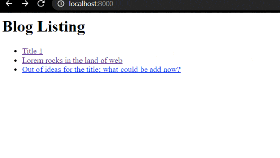

# Django View Authorization

- [Django View Authorization](#django-view-authorization)
  - [Summary](#summary)
  - [Building the cloned respository](#building-the-cloned-respository)
  - [Starting from the beginning](#starting-from-the-beginning)
  - [Detecting Logged-In Users and Their Roles in a View](#detecting-logged-in-users-and-their-roles-in-a-view)
  - [Implementing Django View Authorization](#implementing-django-view-authorization)
    - [Restricting Views to Logged-in Users](#restricting-views-to-logged-in-users)
    - [Restricting views to Admin and Staff](#restricting-views-to-admin-and-staff)
  - [Messaging a Logged-In User](#messaging-a-logged-in-user)

## Summary



A sample blogging application that uses user authentication and authorization.

Features:

- `HttpRequest` and `HttpRequest.user` objects
- `Authenticate` and `authorize` users
- differentiate among `regular`, `staff`, and `admin` users
- Secure a view with the `@login_required` decorator
- Restrict a view to different roles with the `@user_passes_test` decorator
- Use the Django `messages framework` to notify users

## Building the cloned respository

`git clone https://github.com/sunilale0/django-view-authorization.git`

```shell
cd django-view-authorization
```

set up a virtual environment

```shell
pip install -r requirements.txt
django manage.py migrate
django manage.py createsuperuser
python manage.py runserver
```

visit `localhost:8000/admin/` to log in and create blog posts and add new users that are 1. staff user and 2. normal user. Skimm through the tutorial below to test various urls for authentication.

## Starting from the beginning

I started by opening my vscode in a new folder. If I run the regular `django-admin startproject 'project_name'`, it will create two level of folders with the same name, i.e `project_name/project_name/` where the second one will be the main project. Instead, I want to build the project on the same directory I am working on. The command that worked:

```shell
django-admin startproject blog .
```

Some more commands to run on terminal/shell:

```shell
python manage.py startapp core
mkdir templates
python manage.py migrate
python manage.py createsuperuser
```

Add the new app `core` to the `INSTALLED_APPS` in `Blog/settings.py`

```python
INSTALLED_APPS = [
    # ... ,
    "core",
]
```

include the directory of `templates` in `blog/setting.py`:

```python
TEMPLATES = [
    {
        # ...,
        "DIRS": [os.path.join(BASE_DIR, "templates")],
        # ...,
    },
]
```

Add the following to `core/models.py`:

```python
from django.db import models

class Blog(models.Model):
    title = models.CharField(max_length=50)
    content = models.TextField()
```

Create two views in `core/views.py`

1. List all the blogs
2. View a blog

```python
from django.http import HttpResponse
from django.shortcuts import render, get_object_or_404
from core.models import Blog

def listing(request):
    data = {
        "blogs": Blog.objects.all(),
    }
    return render(request, "listing.html", data)

def view_blog(request, blog_id):
    blog = get_object_or_404(Blog, id=blog_id)
    data = {
        "blog": blog,
    }
    return render(request, "view_blog.html", data)

```

3 template files go with the two views `templates/listing.html`

1. base template in `templates/base.html`

```html
<html>
  <body>
     
  </body>
</html>
```

2. template to list all blogs `templates/listing.html`

```html
 
<h1>Blog Listing</h1>
<ul>
  
  <li><a href="">{{ blog.title }}</a></li>
  
</ul>

```

3. template to view each of the blogs `templates/view_blog.html`

```html
 

<h1>{{ blog.title }}</h1>
{{ blog.content | safe }}

<hr />

<a href="">All Blogs</a>

```

`templates/listing.html` and `templates/view_blog.html` files use the `` tag to look up the URLs associated with the `listing()` and `view_blog()` views. These URLs need to be registered in `blog/urls.py`. Add the following in `blog/urls.py`:

```python
# from ...
from django.urls import path, include
from core import views as core_views

urlpatterns=[
    # ... ,
    path("", core_views.listing, name="listing"),
    path("view_blog/<int:blog_id>/", core_views.view_blog, name="view_blog"),
]

```

So far, we have not created a way to creat content. we can add that feature by registering `Blog` object in `core/admin.py`

```python
from django.contrib import admin
from core.models import Blog

@admin.register(Blog)
class BlogAdmin(admin.ModelAdmin):
    pass
```

## Detecting Logged-In Users and Their Roles in a View

Every Django view takes at least one argument, an [HttpRequest](https://docs.djangoproject.com/en/3.0/ref/request-response/#httprequest-objects).
The request contains state information about the user and the page they're visiting like:

| Attribute | Description                               | Examples                           |
| --------- | ----------------------------------------- | ---------------------------------- |
| `scheme`  | URL scheme                                | "http" or "https"                  |
| `body`    | The raw HTTP request body as a bytestring |                                    |
| `path`    | Path portion of the URL                   | "/music/bands/"                    |
| `method`  | HTTP method used                          | "GET" or "POST"                    |
| `GET`     | Query string parameters                   | <QueryDict: {"band_id" : ['123']}> |
| `POST`    | Fields from a HTTP POST                   | <QueryDict: {"name": ["Bob"]}>     |
| `user`    | Object describing the user                |                                    |

Django has the ability to run code on every single request through a plugin mechanism called middleware. The user attribute is added to the HttpRquest object by the [AuthenticationMiddleware](https://docs.djangoproject.com/en/3.0/ref/middleware/#django.contrib.auth.middleware.AuthenticationMiddleware) plugin. How to create a Django middleware? [Here](https://www.valentinog.com/blog/django-middleware/) is an article.

To see some of the `HttpRequest` attributes in action, add the following view to `core/views.py`:

```python
def see_request(request):
    text = f"""
        Some attributes of the HttpRequest object:

        scheme: {request.scheme}
        path: {request.path}
        method: {request.method}
        GET: {request.GET}
        user: {request.user}
        body: {request.body}


    """
    return HttpResponse(text, content_type="text/plain")
```

Now, add this view to `Blog/urls.py`:

```python
# from ...

urlpatterns = [
    # ...,
    path("see_request/", core_views.see_request),
]
```

Visit `localhost:8000/see_request/` to see what is printed.
Visit `localhost:8000/see_request/?who=unknown&why=idk` to see a change.
the following text will be returned

```text
Some attributes of the HttpRequest object:

        scheme: http
        path: /see_request/
        method: GET
        GET: <QueryDict: {'who': ['unknown'], 'why': ['idk']}>
        user: AnonymousUser
        body: b''
```

Here, we didn't need to create a template because, `HttpResponse(text, content_typ="text/plain")` took care of it.

user is `AnonymousUser` because Django assigns this object if you are not logged in.
All users including `AnonymousUser` have some attributes that give use more information about the user.
To see how these work, add the following code in `core/views.py`

```python
def user_info(request):
    text = f"""
        Selected HttpRequest.user attirbutes:

        username: {request.user.username}
        is_anonymous: {request.user.is_anonymous}
        is_staff: {request.user.is_staff}
        is_superuser: {request.user.is_superuser}
        is_active: {request.user.is_active }

    """

    return HttpResponse(text, content_type="text/plain")
```

Add this view to `Blog/urls.py`:

```python
# from ...

urlpatterns = [
    # ...,
    path("user_info/", core_views.user_info),
]
```

If I am not logged in I get the following output

```text
Selected HttpRequest.user attirbutes:

        username:
        is_anonymous: True
        is_staff: False
        is_superuser: False
        is_active: False

```

If I am logged in, I get the following output:

```
 Selected HttpRequest.user attirbutes:

        username: root
        is_anonymous: False
        is_staff: True
        is_superuser: True
        is_active: True
```

Django uses sessions to mange the state of the user. [Sessions](https://docs.djangoproject.com/en/3.1/topics/http/sessions/) are managed through [middleware](https://docs.djangoproject.com/en/3.1/topics/http/middleware/).

## Implementing Django View Authorization

Creating a Django view with authorization is just about inspecting the HttpRequest.user object and seeing if the user is allowed to visit the page.
Here is what we will do:

- user isn't logged in, send them back to the lgoin page

### Restricting Views to Logged-in Users

Django supports two different ways of controlling what users can see and do: groups and [permissions](https://docs.djangoproject.com/en/3.0/topics/auth/default/#permissions-and-authorization) and a lighter-weight system. We will use lighter-weight system.

Python has a feature called decorators. A decorator is a way of wrapping the function with another function. Django uses these decorators to help enforce authentication. Vist [here](https://realpython.com/primer-on-python-decorators/) to read more about it.

Let's see decorators in action.
include the following code in `core/views.py`:

```python
from django.contrib.auth.decorators import login_required

@login_required
def private_place(request):
    return HttpResponse("Shh, members only!", content_type="text/plain")
```

Register the url associated with it in `blog/urls.py`:

```python
# from ...

urlpatterns = [
    # ...,
    path("private_place", core_views.private_place),
]
```

Check if you can access `localhost:8000/private_place` with and without logging in. If you try to acces the `private_place/` without login you will get a `Page not found` error as you get redirected to `localhost:8000/accounts/login/?next=/private_place`. Next, we will create a view and template for `localhost:8000/accounts/login`

Django provides a [LoginRequired-mixin](https://docs.djangoproject.com/en/3.1/topics/auth/default/#the-loginrequired-mixin) to achieve the same for class-based views.

Now, let's create a template for loggin in :
add authorization URLs to `blog/urls.py`:

```python
# from ...

urlpatterns = [
    # ...,
    path("accounts/", include("django.contrib.auth.urls")),
]
```

This allows us to take advantage of all of Django's built-in authentication views.
Create a `registration/` subfolder in `templates/` and then create a `login.html` with the following information

```html
 
<h1>Login</h1>

<form method="post">
   {{ form.as_p }}
  <input type="submit" value="Login" />
</form>

<a href="">All Blogs</a>

```

If you try to access `localhost:8000/private_place` again, you will redirecte to this log in url.

### Restricting views to Admin and Staff

First, create two other users. Admin Dashboard >> Users >> Add User. After adding the user, make sure to set one's permission to `active` only and another's permission to `active` and `staff status`.

Including the first user or `superuser`, we now have 3 users: a `regular user`, a `staff member`, and a `superuser`.
By logging in as any of the users, we should be able to acces `private_place` because `@login_required` only checks if someone is logged in.

To chec the type of user that is logged in we can use [`@user_passes_test`](https://docs.djangoproject.com/en/3.1/topics/auth/default/#django.contrib.auth.decorators.user_passes_test) decorator.

Let's create a view for `staff only`
add the following to `core/views.py`:

```python
from django.contrib.auth.decorators import user_passes_test

# lambda function takes 1 parameter, ":" checks if user.is_staff is true
@user_passes_test(lambda user: user.is_staff)
def staff_place(request):
    return HttpResponse("Employees must wash hands", content_type="text/plain")
```

With `staff_place` view in place, update `blog/urls.py` file to register it.

```python
# from ...

urlpatterns = [
    # ...,
    path("staff_place/", core_views.staff_place),
]
```

Now, visit `localhost:8000/staff_place`. Log in with all of the user and visit the url. We will see that one of the users don't work, because it is not staff or a superuser.

For logging in, `locahost:8000/admin/` might not work for all users. So, go to `localhost:8000/accounts/login` and log in. If you are redirected to `localhost:8000/accounts/profile/` with `page not found` error, that means you are logged in, the error is there because we don't have the template for that url. after logging in got to `localhost:8000/staff_place`.

Note, it seems that a user has to be a staff and superuser to be able to login to admin dashboard. I accidentally broke superuser login when I set it's staff status to false. To fix that here is what I did:

```shell
python manage.py shell
from django.contrib.auth.models import User
u = User.objects.get(username="root")
u.is_staff = True
u.save()
u.quit()
```

Under the covers, the `@login_required` decorator actuall calls the `@user_passes_test` decorator, which would look like

```python
@user_passes_test(lambda user: user.is_authenticated)
```

Similarly we can use `@user_passes_test` and `is_superuser` to build and protect view only available for `superuser`.

## Messaging a Logged-In User

Django includes a mechanism for notifying the users. The [`messges`](https://docs.djangoproject.com/en/3.0/ref/contrib/messages/) framework uses middleware to make any outstanding notifications for the user available in any view. By default, messages support the following five levels:

1. `DEBUG`
2. `INFO`
3. `SUCCESS`
4. `WARNING`
5. `ERROR`

The messages framwork is used primarily for asynchronous communication with the user. For example, if a background job goes wrong, then you can inform the user by sending a message with the `ERROR` level.

There's no area in admin for creating messages - they have to be created in code.

Add the following code in `core/views.py`:

```python
from django.contrib import messages

@login_required
def add_messages(request):
    username = request.user.username
    messages.add_message(request, messages.INFO, f"Hello {username}")
    messages.add_message(request, messages.WARNING, "DANGER LOOMING AROUND")
    return HttpResponse("Messages added", content_type="text/plain")
```

`messges.add_messages()` takes three aruments: `HttpRequest` object, Message level, and Message.

To use `messages.add_message()`, we need to register the view as a URL.

in `blog/urls.py` add:

```python
# from ...

urlpatterns = [
    # ...,
    path("add_messages/", core_views.add_messages),
]

```

You can access messages in the code using [`get_messages()`](https://docs.djangoproject.com/en/3.1/ref/contrib/messages/#using-messages-in-views-and-templates) or directly within a template using the messages value in the template context. Add the following code to `templates/listing.html`:

```html
<!-- ... -->
<!--<h1> Blog Listing </h1>-->

<ul class="messages" style="background-color:#ccc">
  
  <li  class="{{ message.tags }}" >
    {{ message }}
  </li>
  
</ul>

<!--<ul>-->
<!--{% for blog in ... -->
<!-- ... -->
```

This is the end of the guide. If we need more roles, we can add them by using groups and permissions and then allow or block contents according to the access permissions. More aobut groups and permissions [here](https://docs.djangoproject.com/en/3.0/topics/auth/default/#permissions-and-authorization).

Thanks [RealPython](https://realpython.com/django-view-authorization/) for the tutorial.
Discuss ideas [here]().
Report issues [here]().
